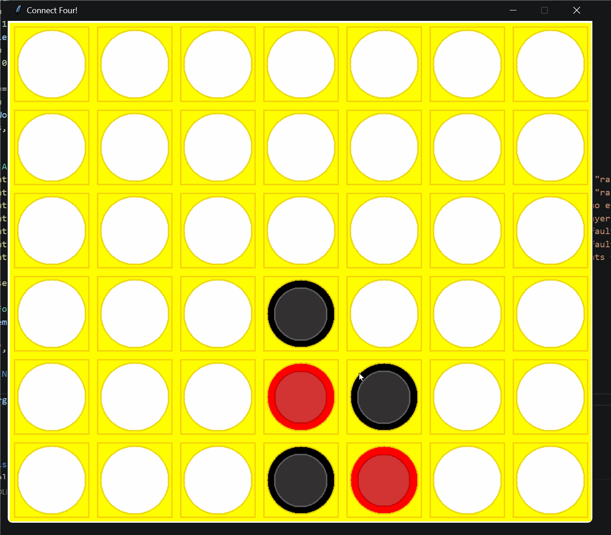

# Intro-to-Artificial-Intelligence

Dr. Duvall teaches this course at Elon University. All the projects are from the course. 

# Connect Four AI Agent

# Our Agent (AA)
For our connect four agents, we looked at the state of the board and determined how likely 
the minimum or maximum player is to win the game. Our agent contains methods for evaluating horizontal,
vertical, and diagonal connections on the game board. We count the possible
horizontal, vertical, and diagonal wins for both sides and then increase/decrease the eval
score accordingly. We also evaluate how close the wins are. If the win is closer to the bottom, it is more achievable, and then we increase/decrease the eval score accordingly. Lastly,
we determine the side on which player is the first player, then they would be more likely to win
by playing odd rows; on the other hand, the second player is more likely to win by playing even
rows. This is because at the end of the game when there is 1 column left, both sides have
no option to place it. If the odd player wins on the odd row closer to the bottom (like
rows 1 and 3), then the odd/first player will win. On the other hand, if the even player wins in
row lower and is closer to the bottom (like rows 2 and 4), then the even player will win. Additionally,

it considers certain strategic elements, such as early game moves on the edges and middle. It
will penalize the player because you don’t want to play the first one on the col 0 or the last
column. After all, they are less likely to give you a win compared to the middle. It also considers
potential traps such as (..00.. Or ..XX..). The overall evaluation combines these factors, resulting
in a numerical score that indicates who is more likely to win based on the current game state.
For the eval, we counted all the possible wins and losses on the horizontal and vertical planes and added them to eval based on those numbers. We also implemented a checker to see
who played first (odd player) and second (even player) because the player who plays first has
an advantage playing on odd rows. In contrast, the player who plays second has an advantage playing
on even rows, so we considered this when calculating our eval. We also normalized our
eval value to ensure it stays in the range of 1 to -1.

Investigations
The biggest difference makers in the agent are the possible horizontal and vertical win counters.
With those methods removed, the agent performs significantly worse. With both removed, the
agent still wins against the benchmark; however, there are many more draws. With only one
removed, the agent wins more but still less than the complete agent. Removing 
horizontal or vertical yields similar results if the agent is not performing as well. The center pl, and early edge methods don’t have as big of an impact. The agent still wins a good amount
with those methods removed. We ran the comparison agents 10 times against
the benchmark agent for all the trials to record and check the performance.

## Video Walkthrough

Here's a walkthrough of implemented user stories:

GIF created with [LiceCap](http://www.cockos.com/licecap/).
